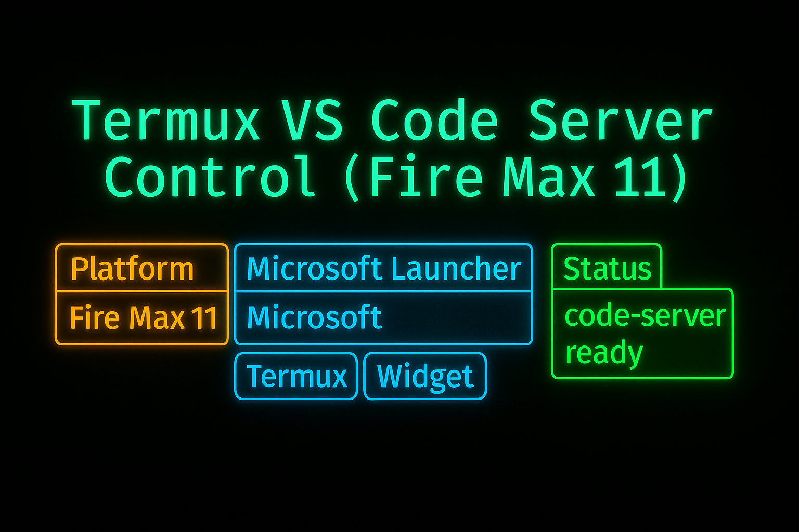

# Termux VS Code Server Control (Fire Max 11)


This project provides simple bash scripts and Termux:Widget shortcuts to start, stop, toggle, and check the status of a locally hosted `code-server` (VS Code in the browser) running inside Termux.

> ✅ Tested on **Amazon Fire Max 11** using **Fire OS 8.3.3.4** and **Microsoft Launcher** for widget access.

---

## 📦 Features

- `start-code-server.sh`: Starts code-server on localhost port 8080
- `stop-code-server.sh`: Terminates any running code-server instance
- `toggle-code-server.sh`: Starts or stops based on current state
- `status-code-server.sh`: Displays current running state

Each script has a matching `.shortcuts/` entry for widget launching.

---

## 🧱 Folder Structure

```
termux-vscode-scripts/
├── start-code-server.sh
├── stop-code-server.sh
├── toggle-code-server.sh
├── status-code-server.sh
└── .shortcuts/
    ├── Start VS Code
    ├── Stop VS Code
    ├── Toggle VS Code
    └── VS Code Status
\`\`\`

---

## 🔧 Setup Instructions

### 1. Clone the Repo
\`\`\`bash
git clone https://github.com/Astrotheque/termux-vscode-scripts.git
cd termux-vscode-scripts
chmod +x *.sh .shortcuts/*
\`\`\`

### 2. Copy or Symlink the Shortcuts
\`\`\`bash
mkdir -p ~/.shortcuts
cp .shortcuts/* ~/.shortcuts/
\`\`\`

### 3. Install Required Termux Packages
\`\`\`bash
pkg install nodejs
npm install -g code-server
\`\`\`

---

## 🧩 Using Termux:Widget

### 🔹 Fire OS (Fire Max 11) Note

- Fire OS disables custom launchers and widgets on the default home screen.
- Workaround: use **Microsoft Launcher** and open its **Widget screen** to access the Termux Widget interface.

### 🔹 Install Termux:Widget

1. Download from [F-Droid](https://f-droid.org/en/packages/com.termux.widget/) or [GitHub Releases](https://github.com/termux/termux-widget/releases)
2. Install via Android's native installer (tap `.apk` in file manager)
3. Add the widget via Microsoft Launcher
4. Tap your scripts to run them from the widget interface

---

## 🧠 Tips

- Scripts use `nohup` to stay alive in background
- Process control is handled via `pkill -f code-server`
- Customize bind IP/port if needed

---

## 📜 License

MIT License

---

## 👤 Maintainer

Astrotheque  
[https://github.com/Astrotheque](https://github.com/Astrotheque)
